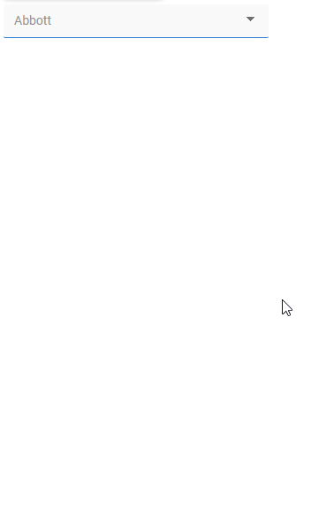

# DropDown Seperators <!-- omit in toc -->

Make finding an option easier by splitting DropDown options into groups with a separator (hr)



# Version
Initial 1.0

# Setup

## Application Setup
1. Check the *Enable Style Sheet* checkbox in the application properties

## Global Script
1. Create a Global Script called "DropDownSeparators"
2. Add the input parameters below to the Global Script
   1. DropDownClass
   2. LastValues
3. Drag a *JavaScript* action into the script
4. Add the Javascript below into the JavaScript code property
```javascript
/* Stadium Script v1.0 https://github.com/stadium-software/dropdown-separators */
let ddClass = ~.Parameters.Input.DropDownClass;
if (!ddClass) {
    console.error("The DropdownClass parameter is required");
    return false;
}
let dd = document.querySelectorAll(".drop-down-container." + ddClass);
if (dd.length == 0) {
    console.error("The class '" + ddClass + "' is not assigned to a DropDown");
    return false;
} else if (dd.length > 1) {
    console.error("The class '" + ddClass + "' is assigned to multiple DropDowns");
    return false;
}
dd = dd[0];
let ddOptions = dd.querySelectorAll("select option");
let insertBelow = ~.Parameters.Input.LastValues || [];
for (let i = 0; i < ddOptions.length; i++) {
    if (insertBelow.includes(ddOptions[i].value)) {
        let hr = document.createElement("hr");
        ddOptions[i].after(hr);
    }
}
if (!document.getElementById("select-separator-styles")) {
    let css = `select hr + hr,select :first-child:is(hr) {display: none;}`;
    let head = document.head || document.getElementsByTagName('head')[0], style = document.createElement('style');
    style.type = 'text/css';
    style.id = "select-separator-styles";
    style.appendChild(document.createTextNode(css));
    head.appendChild(style);
}
```

## Page
1. Add a *DropDown* control to a page
2. Add a unique class to the *DropDown* *Classes* property (e.g. separated-dropdown)
3. Optionally assign static data to the control

## Page.Load
1. Optionally assign data from a *Connector* to the control
2. Drag a *List* into the event handler
3. Add values to the *List* that correspond with the values of the options under which a separator must be shown
4. Drag the "DropDownSeparators" into an event handler (below all actions that assign the data)
   1. DropDownClass: Provide the unique classname assigned to the dropdown above (e.g. separated-dropdown)
   2. LastValues: Select the *List* of dropdown values

## Styling
Separators in select tags cannot as yet be styled

## Working with Stadium Repos
Stadium Repos are not static. They change as additional features are added and bugs are fixed. Using the right method to work with Stadium Repos allows for upgrading them in a controlled manner. How to use and update application repos is described here 

[Working with Stadium Repos](https://github.com/stadium-software/samples-upgrading)